 

---

# 👋 Opa!
Prazer, eu me chamo **Matheus Camilo**.
Sou estudante de **Engenharia de Software** e desenvolvedor **Full Stack** com foco em **Java**.

Tenho interesse no desenvolvimento de softwares, aplicações web e aplicativos, buscando criar soluções modernas, escaláveis e bem estruturadas por meio de boas práticas de desenvolvimento.

Atualmente estou aprofundando meus conhecimentos em **Spring Boot**, **Docker**, **React** e boas práticas de desenvolvimento.

---

## 💻 Tecnologias

  

---
# 🚀 Projetos

### 📌 Help Desk System

Sistema web para gerenciamento de chamados técnicos inspirado em ambientes corporativos.

**Tecnologias**

`Java EE` • `Hibernate` • `JPA` • `Servlets` • `JSP` • `MariaDB` • `JavaScript`

---

### 🎨 Nicolas Portfolio

Sistema completo de portfólio para um artista digital, incluindo site público, painel administrativo e API REST para gerenciamento de conteúdo.

**Stack**

`Java 21` • `Spring Boot` • `Spring Data JPA` • `Hibernate` • `MySQL` • `HTML` • `CSS` • `JavaScript`

🚧 Em desenvolvimento

---

### 🎓 Sistema Aluno Ajax

Sistema para cadastro e consulta de alunos utilizando requisições AJAX e Servlets.

**Tecnologias**

`Java EE` • `Servlets` • `Ajax` • `MariaDB`

---

# 📫 Contato

- 💼 **LinkedIn:** [https://linkedin.com/in/matheuscamilo-dev](https://www.linkedin.com/in/matheuscamilo-dev/)
- 📧 **E-mail:** mattcb.rj@gmail.com

---

*"Turning ideas into software."* 🚀

