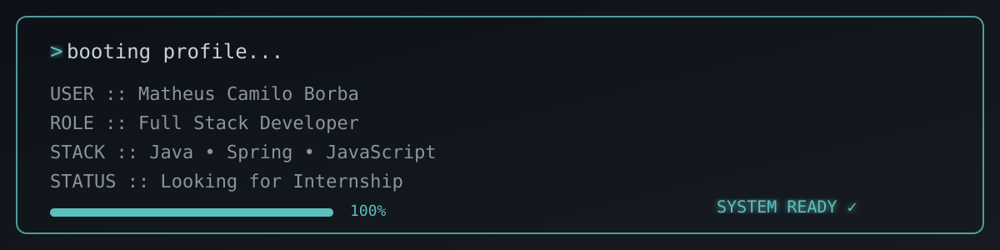

<div align="center">




<br>

[](https://www.linkedin.com/in/matheuscamilo-dev/)
[](https://SEU-PORTFOLIO.vercel.app)
[](mailto:mattcb.rj@gmail.com)
</div>

---

## 👋 Sobre mim

Sou o **Matheus Camilo**, estudante de **Engenharia de Software** e desenvolvedor **Full Stack**, com foco em **Java e Spring Boot**.

Gosto de transformar problemas do dia a dia em sistemas bem estruturados — de preferência com uma xícara de café por perto ☕. Atualmente, estou aprofundando meus conhecimentos em **Spring Boot, APIs REST, JWT, React, TypeScript, Tailwind CSS**, buscando sempre escrever código organizado e fácil de manter.

```java
public class Matheus {
    String[] stack = {
        "Java",
        "Spring Boot",
        "JWT",
        "React",
        "TypeScript",
        "Tailwind CSS",
    };

    String status = "Aberto a oportunidades 🚀";
    boolean debugandoAsMinhas1hDaManha = true;
}
```

---

## 💻 Tecnologias

<div align="center">

### Backend


`JWT` · `BCrypt` · `JPA` · `REST API` · `Spring Security`

### Frontend


`React` · `TypeScript` · `Tailwind CSS`

### Ferramentas


`Git` · `GitHub` · `Docker` · `Insomnia`

</div>

---

## 🚀 Projetos em destaque

### 📌 Help Desk System

Sistema web para gerenciamento de chamados técnicos inspirado em ambientes corporativos.

`Java EE` `Hibernate` `JPA` `Servlets` `JSP` `MariaDB` `JavaScript`

### 🎨 Nicolas Portfolio — 🚧 *Em desenvolvimento*

Sistema completo de portfólio para um artista digital, com site público, painel administrativo e API REST para gerenciamento de conteúdo.

`Java 21` `Spring Boot` `Spring Data JPA` `Hibernate` `MySQL` `React` `TypeScript` `Tailwind CSS` `JWT`

### 🎓 Sistema Aluno Ajax

Sistema para cadastro e consulta de alunos utilizando requisições AJAX e Servlets.

`Java EE` `Servlets` `AJAX` `MariaDB`

---

## 📫 Contato

<div align="center">

[](https://www.linkedin.com/in/matheuscamilo-dev/)
[](mailto:mattcb.rj@gmail.com)

<br>

*"Cada bug corrigido é uma pequena vitória."* 🚀

</div>
